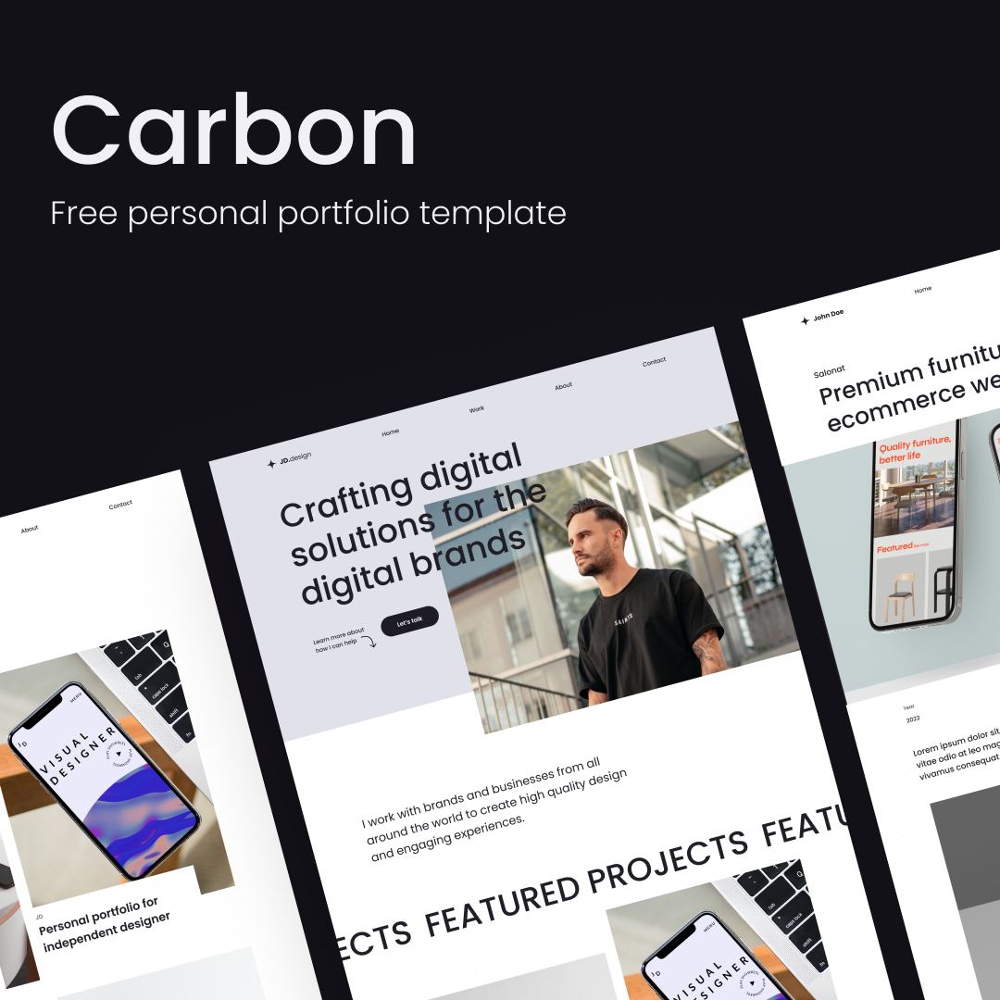

# Carbon


Carbon is free TailwindCSS portfolio template that's perfect for developers and designers. It comes with a high-quality design and all the essential components & pages you need to launch a complete portfolio website.

[Live Preview](https://carbon-theme.netlify.app/)

**Features:**
- Responsive
- Include 5 pages, Home, Work, case study, about, and contact
- Clean and well designed
- Well documented


**Note: please keep in mind that this is free work and a lot of hours had put into making it. So be mindful and keep (Designed by MYoussouf) credit at the footer.**


## Download
Download this repo by clicking on the Download Zip button or by using git CLI

```
git clone https://github.com/MohamedYoussouf/carbon.git
```

Install the dependencies

```
npm install
```

run the development server

```
npm run dev
```

**Note: All the HTML pages and necessary assets are in the public folder**

## License
This project is licensed under the MIT License - see the [LICENSE.md](LiCENsE.md) file for details